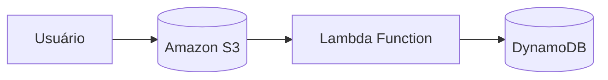

# 🚀 Executando Tarefas Automatizadas com AWS Lambda Function e Amazon S3

## 📘 Descrição do Projeto

Este repositório contém o desafio da Digital Innovation One (DIO): **Executando Tarefas Automatizadas com AWS Lambda Function e Amazon S3**.

O objetivo é aplicar os conceitos de **Serverless** e **Integração de Serviços AWS**, utilizando o **AWS Lambda**, **Amazon S3** e **DynamoDB**, 
criando um fluxo automatizado para **processamento de arquivos** e **armazenamento de registros**.

---

## 🎯 Objetivos de Aprendizagem

- Entender o funcionamento do Amazon S3, AWS Lambda e DynamoDB.
- Criar funções Lambda integradas com eventos S3.
- Automatizar o processamento e registro de dados na AWS.
- Documentar tecnicamente o projeto e publicá-lo no GitHub.
- Reproduzir o ambiente localmente com LocalStack.

---

## 📁 Estrutura do Projeto

```bash
desafio-lambda-s3/
├── README.md                # Documentação principal
├── docker-compose.yml       # Configuração do LocalStack
├── create_resources.sh      # Script para criar recursos locais
├── requirements.txt         # Dependências do projeto
├── infra/
│   └── template.yml         # Template CloudFormation (opcional)
├── src/
│   └── lambda_function.py   # Função Lambda principal
└── entrega/
    └── instrucoes_para_entrega.md
```

---

## ⚙️ Passo a Passo de Execução

1. Clone este repositório:
   ```bash
   git clone https://github.com/seu-usuario/desafio-lambda-s3.git
   cd desafio-lambda-s3
   ```

2. Inicie o ambiente LocalStack:
   ```bash
   docker-compose up -d
   ```

3. Crie os recursos AWS simulados:
   ```bash
   bash create_resources.sh
   ```

4. Teste a função Lambda localmente:
   ```bash
   python src/lambda_function.py
   ```

5. (Opcional) Faça o deploy na AWS real via AWS Console ou SAM CLI.

---

## 🧠 Arquitetura do Projeto

**Fluxo de funcionamento:**
1. O usuário faz upload de um arquivo no bucket S3.
2. O evento dispara a função Lambda automaticamente.
3. A Lambda processa o arquivo e registra as informações no DynamoDB.



---

## 🧩 Modelo CloudFormation (`template.yml`)

```yaml
AWSTemplateFormatVersion: '2010-09-09'
Description: Template para criação de infraestrutura serverless com S3, Lambda e DynamoDB

Resources:
  S3BucketUploads:
    Type: AWS::S3::Bucket
    Properties:
      BucketName: lambda-s3-upload-bucket

  DynamoDBTable:
    Type: AWS::DynamoDB::Table
    Properties:
      TableName: UploadsMetadata
      AttributeDefinitions:
        - AttributeName: id
          AttributeType: S
      KeySchema:
        - AttributeName: id
          KeyType: HASH
      BillingMode: PAY_PER_REQUEST

  LambdaProcessor:
    Type: AWS::Lambda::Function
    Properties:
      FunctionName: process-upload-lambda
      Runtime: python3.12
      Handler: lambda_function.lambda_handler
      Role: arn:aws:iam::123456789012:role/lambda-execution-role
      Code:
        ZipFile: |
          import json
          def lambda_handler(event, context):
              print("Evento recebido:", event)
              return {"statusCode": 200, "body": json.dumps("Processamento concluído")}
```

---

## 💡 Aprendidos e Insights

- AWS Lambda e S3 são ferramentas poderosas para automação de tarefas e redução de custos.
- Com DynamoDB, é possível registrar logs e metadados de forma escalável.
- LocalStack permite desenvolver e testar soluções AWS localmente.
- CloudFormation garante versionamento e reprodutibilidade da infraestrutura.

---

## 🔗 Links Úteis

- [Documentação AWS Lambda](https://docs.aws.amazon.com/lambda)
- [Documentação Amazon S3](https://docs.aws.amazon.com/s3)
- [Documentação AWS CloudFormation](https://docs.aws.amazon.com/cloudformation)
- [Digital Innovation One (DIO)](https://www.dio.me)

---

## ✍️ Autor

Desenvolvido por **MIRTES FERNANDA DUTRA DA SILVA**  
Desafio da **Digital Innovation One (DIO)** — *Executando Tarefas Automatizadas com AWS Lambda Function e Amazon S3*
